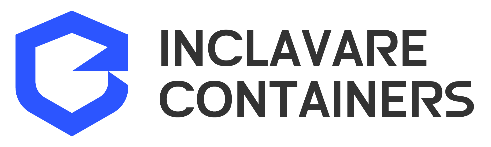
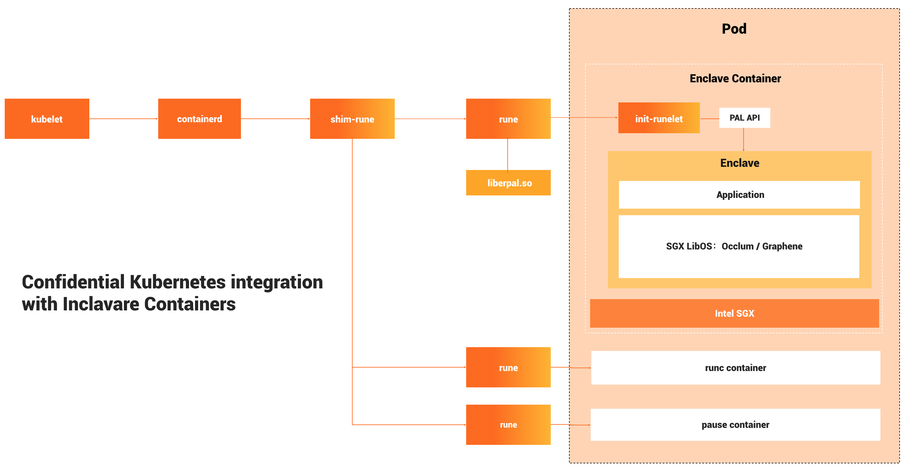

Inclavare Containers is an innovation of container runtime with the novel approach for launching protected container in hardware-assisted Trusted Execution Environment (TEE) technology, aka Enclave, which can prevents the untrusted ent, such as Cloud Service Provider (CSP), from accessing the sensitive and confidential assets in use.

Please refer to [Terminology](docs/design/terminology.md) for more technical expressions used in Inclavare Containers.

# Audience

Inclavare Containers is helping to keep tenants' confidential data secure so they feel confident that their data is not being exposed to CSP or their own insiders, and they can easily move their trusted applications to the cloud.

# Architecture

Inclavare Containers follows the classic container runtime design. It takes the adaption to [containerd](https://github.com/containerd/containerd) as first class, and uses dedicated [shim-rune](https://github.com/alibaba/inclavare-containers/tree/master/shim) to interface with OCI Runtime [rune](https://github.com/alibaba/inclavare-containers/tree/master/rune). In the downstrem, [init-runelet](https://github.com/alibaba/inclavare-containers/blob/master/docs/terminology.md#init-runelet) employs a novel approach of launching [enclave runtime](https://github.com/alibaba/inclavare-containers/blob/master/docs/terminology.md#enclave-runtime) and trusted application in hardware-enforced enclave.



The major components of Inclavare Containers are:

- rune
  `rune` is a CLI tool for spawning and running enclaves in containers according to the OCI specification.

  `rune` is already written into [OCI Runtime implementation list](https://github.com/opencontainers/runtime-spec/blob/master/implementations.md#runtime-container).

- shim-rune
  shim-rune resides in between containerd and `rune`, conducting enclave signing and management beyond the normal `shim` basis. In particular shim-rune and `rune` can compose a basic enclave containerization stack for confidential computing, providing low barrier to the use of confidential computing and the same experience as ordinary container. Please refer to [this doc](shim/README.md) for the details.

- enclave runtime
  The backend of `rune` is a component called enclave runtime, which is responsible for loading and running trusted and protected applications inside enclaves. The interface between `rune` and enclave runtime is [Enclave Runtime PAL API](rune/libenclave/internal/runtime/pal/spec.md), which allows invoking enclave runtime through well-defined functions. The softwares for confidential computing may benefit from this interface to interact with cloud-native ecosystem.

  One typical class of enclave runtime implementations is based on Library OSes. Currently, the default enclave runtime interacting with `rune` is [Occlum](https://github.com/occlum/occlum), a memory-safe, multi-process Library OS for Intel SGX.

  In addition, you can write your own enclave runtime with any programming language and SDK (e.g, [Intel SGX SDK](https://github.com/intel/linux-sgx)) you prefer as long as it implements Enclave Runtime PAL API.

# Non-core components 

- sgx-tools
  sgx-tools is a CLI tool, used to interact Intel SGX AESM service to retrieve various materials such as launch token, quoting enclave's target information, enclave quote and remote attestation report from IAS. Refer to [this tutorial](sgx-tools/README.md) for the details about its usage.

# Roadmap

# Building

# Installing


# Integrating

Inclavare Containers can be integrated with dockerd and containerd.

## dockerd

Add the assocated configurations for `rune` in dockerd config file, e.g, `/etc/docker/daemon.json`, on your system.

```json
{
        "runtimes": {
                "rune": {
                        "path": "/usr/bin/rune",
                        "runtimeArgs": []
                }
        }
}
```

then restart dockerd on your system.

You can check whether `rune` is correctly enabled or not with:

```shell
docker info | grep rune
```

In order to launch trusted application in [enclave container](docs/terminology.md#enclave-container).

## containerd 

Add the assocated configurations for shim-rune in containerd config file, e.g, `/etc/containerd/config.toml`, on your system.

```toml
        [plugins.cri.containerd]
          ...
          [plugins.cri.containerd.runtimes.rune]
            runtime_type = "io.containerd.rune.v2"
```

then restart containerd on your system.

# Running

[The reference container images](https://hub.docker.com/u/inclavarecontainers) are available for the demonstration purpose to show how a Confidential Computing Kubernetes Cluster with Inclavare Containers works. Currently, web application demos based on OpenJDK 11, Dragonwell, and Golang are provided.

# Tutorials

## Confidential Computing Kubernetes Cluster
show how a Confidential Computing Kubernetes Cluster with Inclavare Containers works.

Please refer to [this guide](docs/develop_and_deploy_hello_world_application_in_kubernetes_cluster.md) to develop and deploy a rune container in a Kubernetes cluster.

## Occlum LibOS

Please refer to [this guide](https://github.com/alibaba/inclavare-containers/blob/master/docs/running_rune_with_occlum.md) to run `Occlum` with `rune`.
